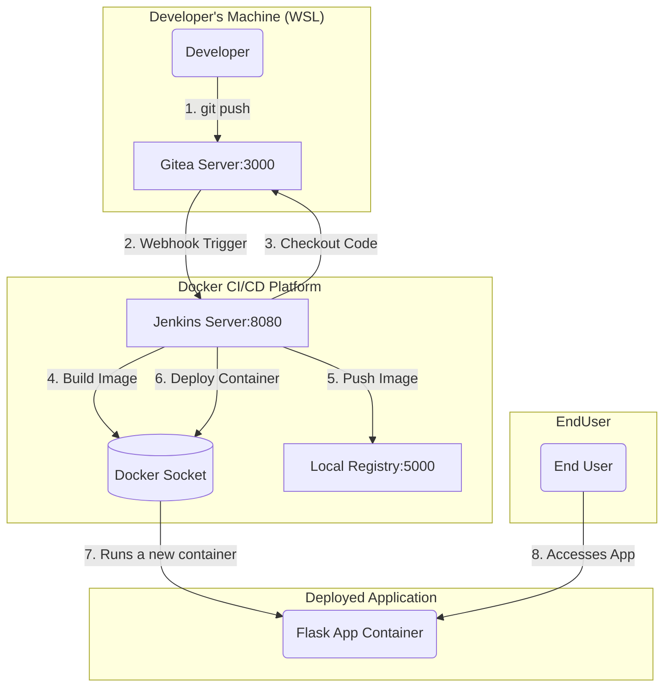

# Project: End-to-End CI/CD Pipeline Platform

This repository contains the infrastructure-as-code for a complete, local CI/CD ecosystem built with Docker. It uses Docker Compose to orchestrate Gitea, Jenkins, and a private Docker Registry, creating a fully automated software delivery pipeline.

This platform is designed to continuously integrate, build, test, and deploy a sample application, which is hosted in a separate repository. The entire system demonstrates a real-world DevOps workflow, including automated triggers, artifact management, and solutions to common configuration and networking challenges.

**Companion Application Repository:** [https://github.com/YogeshT22/sample-flask-app](https://github.com/YogeshT22/sample-flask-app)

---

## Core Concepts & Skills Demonstrated

* **CI/CD Pipeline Design:** Implemented a full, end-to-end pipeline covering all stages: Git Push -> Webhook Trigger -> Code Checkout -> Docker Build -> Push to Registry -> Deploy to "Production".
* **Infrastructure as Code (IaC):** Defined the entire multi-service platform in a single `docker-compose.yml` file, making the environment completely reproducible and version-controlled.
* **Service Orchestration:** Used Docker Compose to manage the lifecycle, networking, and data persistence for all services.
* **Custom Tooling Environments:** Built a custom Jenkins image using a `Dockerfile` to bake in necessary dependencies (Git, Docker CLI), creating a stable and predictable build environment.
* **Internal Networking & Service Discovery:** Configured a shared Docker network (`cicd-net`) to allow services to communicate reliably using their service names (e.g., `jenkins-server`, `gitea-server`).
* **Artifact Management:** Deployed and used a private Docker Registry for storing and versioning the container images (artifacts) built by the pipeline.
* **Complex Debugging & Problem Solving:**
    * Solved container tool-chain issues (`docker: not found` in Jenkins) by creating a custom image.
    * Resolved webhook security blocks (`403 Forbidden`, `Host Not Allowed`) by configuring Jenkins API tokens and Gitea's trusted host list.
    * Fixed cross-platform networking issues between WSL2 and Windows to make the final deployed application accessible.

---

## Architecture Diagram

This diagram illustrates the flow of information and actions within the CI/CD ecosystem.


## **How to Run This Platform**
**Prerequisites:**

- Docker Desktop with WSL2 integration enabled.
- The sample application code pushed to a Gitea repository (see companion repo).
    -(https://github.com/YogeshT22/sample-flask-app)
---

- Step 1: Configure Insecure Registry in Docker

    - Your Docker daemon must be configured to trust the local registry. In Docker Desktop, go to Settings -> Docker Engine and add the following to the JSON configuration, then apply and restart:
    ```bash
    "insecure-registries": [
    "localhost:5000"
    ]
    ```
- Step 2: Launch the Infrastructure
    - This command will build the custom Jenkins image and start all services. The -d flag runs them in the background.
    ```bash 
    docker-compose up --build -d
    ```

- Step 3: Initial Setup
    - On the first run, you will need to perform the one-time setup for Gitea and Jenkins:
Gitea (http://localhost:3000) 
    - On the installation screen, set the Server Domain to gitea-server and the Base URL to http://gitea-server:3000/.
    - Create an admin user.
    - Create a repository for the sample application.
    - Jenkins (http://localhost:8080): Unlock with the initial password from docker logs jenkins-server.
    - Install suggested plugins, plus the Docker Pipeline plugin.
    - Create an admin user.
    - Navigate to Manage Jenkins -> System and set the Jenkins URL to http://jenkins-server:8080/.
- Step 4: Configure the Pipeline
    - Refer to the README.md in the companion application repository for instructions on creating the Jenkins pipeline job and configuring the webhook with an API token.
- Step 5: Clean Up
    - To stop all services and remove the containers and network:
    ``` bash 
    docker-compose down
    ```

To also delete all persistent data (Gitea repos, Jenkins jobs): 
``` bash 
docker-compose down -v
```
---