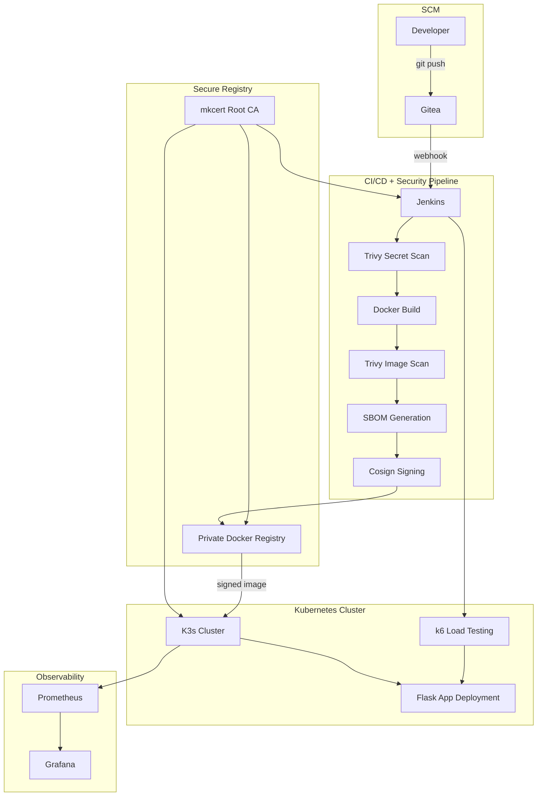

# Production-Grade DevSecOps Platform + K6 Load Testing.

    


## About Repository

This repository contains the Infrastructure as Code for a complete, local DevOps ecosystem that simulates a modern, secure software delivery lifecycle. Using Docker Compose, it orchestrates a suite of best-in-class open-source tools to automatically build, test, secure, and deploy a containerized application to a multi-node Kubernetes cluster.

The platform is designed as a hands-on learning environment to master advanced concepts including native TLS, container security, pipeline-as-code, and Kubernetes automation.

**Companion Application Repository:** [https://github.com/YogeshT22/sample-flask-app](https://github.com/YogeshT22/sample-flask-app)

---

# Project Overview

This platform demonstrates real-world DevOps engineering practices including:

- Infrastructure automation
- Kubernetes cluster lifecycle management
- Secure software supply chain (Trivy, SBOM, Cosign)
- Private TLS container registry
- CI/CD pipeline automation with Jenkins
- Monitoring and observability using Prometheus and Grafana
- Idempotent bootstrap architecture
- K6 load testing integrated into the pipeline

## Production-style Supply Chain & CI/CD Flow

This project implements a "Security First" zero-trust pipeline. Every commit pushes through the following automated phases:

1. **Source & Trigger:** Developer pushes to Gitea → Webhook triggers Jenkins.
2. **Pre-Build Security:** Jenkins scans source code for accidentally committed secrets (`Trivy`).
3. **Build & Package:** Jenkins builds the Docker container.
4. **Post-Build Security:** Jenkins scans the built image for vulnerabilities & generates a CycloneDX SBOM.
5. **Cryptographic Trust:** The image is signed using `Cosign`.
6. **Secure Artifact Storage:** Pushed to a private local Docker Registry authenticated via locally trusted TLS (`mkcert`).
7. **Immutable Deployment:** Kubernetes pulls the signed image and deploys it using its immutable SHA256 digest.
8. **In-Cluster Load Testing:** Jenkins runs k6 tests against the deployed service and archives results.

## Lessons Learned

> This project was an intensive exercise in system integration and debugging.

Key takeaways include:

- **Immutability of Infrastructure:** When a local cluster becomes "poisoned" with bad networking or security configs, it is faster and more reliable to delete and recreate it than to patch it.
- **Explicit Trust is Mandatory:** In a private, secure environment, "automatic" trust doesn't exist. Every communication hop (Jenkins -> Registry -> K8s) requires explicit certificate injection and verification.
- **Pathing and Quoting in WSL:** Windows file paths with spaces require strict quoting to prevent tools like `k3s` from failing to find volumes.
- **Iterative Development:** Building a complex platform like this requires iterative development and testing of each component in isolation before integrating them into the full pipeline.

### IMPORTANT (WSL USERS)

- For best reliability, clone and run the project inside WSL filesystem:

**Correct**:

```bash
~/projects/devsecops-platform
```

###

**Avoid**:

```bash
 /mnt/c/Users/.../Downloads/devsecops-platform
```
###
- This avoids filesystem permission issues caused by Windows mounts.
- If you must run from a Windows path, ensure all paths in the scripts are properly quoted to handle spaces and special characters.

---

## Table of Contents

- [Project Overview](#project-overview)
- [Production-Grade Supply Chain & CI/CD Flow](#-production-grade-supply-chain--cicd-flow)
- [Lessons Learned](#lessons-learned)
- [Core Concepts](#core-concepts--skills-demonstrated)
- [Architecture Diagram](#architecture-diagram)
- [End-to-End Trust Architecture](#end-to-end-trust-architecture)
- [Quick Start (How to Run Platform)](#-quick-start-how-to-run-platform)

## Core Concepts & Skills Demonstrated

- **DevSecOps Pipeline Design:** Implemented a full, multi-stage pipeline with a "Security First" approach:
  
  - `Git Push -> Webhook -> Secret Scan -> Build -> Image Scan -> SBOM Generation -> Image Signing & Verification -> Deploy`
- **Infrastructure Automation:**
  - **Docker Compose:** Used for orchestration of the core CI/CD toolchain.
- **Secure Infrastructure:**
  - **Native TLS Registry:** Deployed a private Docker Registry secured with HTTPS using locally trusted certificates generated by `mkcert`.
  - **End-to-End Trust:** Engineered a "Circle of Trust" where all components (Docker daemon, Jenkins, K3s nodes) are configured to trust the custom root CA, eliminating the need for insecure flags.
- **Container Orchestration:** Deployed and managed applications on a **Kubernetes (K3s)** cluster, using `Deployments`, `Services`, and `Ingress`.
- **Software Supply Chain Security:**
  - **Vulnerability Scanning:** Integrated **Trivy** for both filesystem (pre-build) and container image (post-build) scanning.
  - **SBOM Generation:** Created a CycloneDX Software Bill of Materials for every build.
  - **Image Integrity:** Used **Cosign** to cryptographically sign and verify container images, ensuring they are not tampered with between build and deployment.
- **Observability & Monitoring:** Deployed **Prometheus** and **Grafana** using a **Helm** chart to collect and visualize real-time metrics.
- **In-Cluster Load Testing:** Integrated **k6** load testing into the pipeline, running tests from within Kubernetes to validate the deployed service under realistic conditions.

## Architecture Diagram

```mermaid
flowchart TD

    subgraph SCM
        DEV[Developer]
        GITEA[Gitea]
    end

    subgraph CICD["CI/CD + Security Pipeline"]
        JENKINS[Jenkins]
        TRIVY1[Trivy Secret Scan]
        BUILD[Docker Build]
        TRIVY2[Trivy Image Scan]
        SBOM[SBOM Generation]
        COSIGN[Cosign Signing]
    end

    subgraph REG["Secure Registry"]
        REGISTRY[Private Docker Registry]
        MKCERT[mkcert Root CA]
    end

    subgraph K8S["Kubernetes Cluster"]
        K3S[K3s Cluster]
        APP[Flask App Deployment]
        K6[k6 Load Testing]
    end

    subgraph OBS["Observability"]
        PROM[Prometheus]
        GRAFANA[Grafana]
    end

    DEV -->|git push| GITEA
    GITEA -->|webhook| JENKINS

    JENKINS --> TRIVY1
    TRIVY1 --> BUILD
    BUILD --> TRIVY2
    TRIVY2 --> SBOM
    SBOM --> COSIGN

    COSIGN --> REGISTRY

    MKCERT --> REGISTRY
    MKCERT --> JENKINS
    MKCERT --> K3S

    REGISTRY -->|signed image| K3S

    K3S --> APP

    JENKINS --> K6
    K6 --> APP

    K3S --> PROM
    PROM --> GRAFANA
```

### End-to-End Trust Architecture

This platform implements a complete cryptographic trust chain across the software supply chain:

1. **Certificate Authority (CA)**
   - A custom Root CA is generated using `mkcert`.
   - This CA signs the private Docker Registry TLS certificate.

2. **Trusted Components**
   The Root CA is explicitly injected into:
   - Docker daemon
   - Jenkins container
   - Kubernetes (k3s) nodes

3. **Registry Trust**
   This allows all components to securely communicate with the private registry without insecure flags.

4. **Image Integrity**
   - Images are signed using Cosign private key.
   - Public key (cosign.pub) is stored in repository.
   - Jenkins verifies image signatures before deployment.

5. **Immutable Deployment**
   Kubernetes deploys images using immutable SHA256 digest instead of mutable tags.

This ensures:

- Image authenticity
- Registry authenticity
- Deployment integrity
- End-to-end supply chain security


## Component Responsibilities

| Component        | Role                                           |
| ---------------- | ---------------------------------------------- |
| Gitea            | Source code management and webhook trigger     |
| Jenkins          | CI/CD orchestration, build, scan, sign, deploy |
| Docker Registry  | Secure image storage with TLS                  |
| Trivy            | Secret scanning and vulnerability scanning     |
| Cosign           | Image signing and verification                 |
| Kubernetes (k3s) | Container orchestration                        |
| Prometheus       | Metrics collection                             |
| Grafana          | Metrics visualization                          |
| mkcert           | Local certificate authority                    |
| k6               | In-cluster load testing                        |

## Network Architecture

All services run inside an isolated Docker bridge network:

big-project-2-cicd-pipeline_cicd-net

_name can be changed in `docker-compose.yml` if needed._

This allows secure internal communication using container DNS names:

- gitea-server:3000
- jenkins-server:8080
- local-docker-registry:5000

Kubernetes nodes join the same network via k3s, allowing direct secure image pulls.

No external insecure registry exposure is required.

## Private Registry Security

The private Docker registry is secured using:

- TLS encryption
- Custom Root CA trust
- Internal Docker network isolation

Images are never pulled from public insecure registries during deployment.

This simulates enterprise private registry environments such as:

- AWS ECR
- Azure ACR
- Google Artifact Registry
- Harbor

## Immutable Deployment Strategy

Instead of deploying using mutable tags (latest, v1, etc), this platform deploys using immutable SHA256 image digests:

example:

local-docker-registry:5000/sample-flask-app@sha256:abcd1234...

This prevents:

- image tampering
- tag overwrite attacks
- inconsistent deployments

## 🛠️ Quick Start (How to Run Platform)

### 1. Provision the Infrastructure

The entire platform is provisioned using idempotent automation scripts.

```bash
git clone https://github.com/YogeshT22/big-project-2-cicd-pipeline.git
cd big-project-2-cicd-pipeline

# Will start Docker, K8s, generate TLS certs, and configure Jenkins/Kubeconfig
./bootstrap.sh
```

### 2. Generate Cosign Keys (Image Signing)

This pipeline uses **Cosign** to cryptographically sign container images. You need to generate a key pair before running the pipeline:

```bash
# Install cosign if you haven't already
# Generate a new key pair (Press Enter to leave password blank for automation)
cosign generate-key-pair
```

This generates two files:

1. `cosign.pub`: The public key. Move this into your application repository (`sample-flask-app/cosign.pub`).
2. `cosign.key`: The private key. **Do not commit this.** Upload this file to your Jenkins Credentials store as a **Secret File** with the ID exactly matching: `cosign-private-key`.

### 3. Final Web UI Configurations (One-Time Setup)

Because Gitea and Jenkins run locally inside Docker, you must configure their initial UI connections once:

1. **Gitea:** Go to `http://localhost:8081` and finish the installation using standard SQLite. Create a user and an empty repository named `sample-flask-app`.
2. **Jenkins:** Go to `http://localhost:8080` (get the initial password via `docker logs jenkins-server`).
   - Install the **Docker Pipeline** plugin.
   - Go to Manage Jenkins -> Credentials and add three **Secret File** credentials:
     - ID: `kubeconfig-sa` (Upload the `kubeconfig-jenkins.yaml` generated by the bootstrap script).
     - ID: `cosign-private-key` (Upload the `cosign.key` you generated above).
     - ID: `cosign-passoword` (if used any password while creating cosign key pairs).
3. Create a new Jenkins Pipeline Job, point it to your Gitea repository, and run the build!

---

## Automation Scripts Overview

The platform uses modular, production-style infrastructure automation scripts located in the `scripts/` directory.

Each script has a single responsibility and is safe to rerun (idempotent).

| Script                     | Purpose                                              |
| -------------------------- | ---------------------------------------------------- |
| 01-start-infrastructure.sh | Starts Docker services                               |
| 02-wait-for-services.sh    | Waits until Gitea, Jenkins, and Registry are ready   |
| 03-create-cluster.sh       | Creates or recovers Kubernetes cluster               |
| 04-configure-kubernetes.sh | Configures Kubernetes service account and kubeconfig |
| 05-deploy-monitoring.sh    | Deploys Prometheus and Grafana using Helm            |
| 06-verify-platform.sh      | Verifies full platform functionality                 |
| stop-platform.sh           | Safely stops platform infrastructure                 |
| bootstrap.sh               | Orchestrates full platform provisioning              |
| generate-certs.sh          | Generate CA root and registry certificates.          |

---

## Automated Provisioning Architecture

The platform follows a production-grade bootstrap model:

1. Infrastructure startup
2. Service readiness verification
3. Kubernetes cluster provisioning
4. Trust and credential configuration
5. Monitoring deployment
6. Platform verification

This ensures the platform is:

- Fully reproducible
- Safe to rerun
- Resistant to partial failures
- Suitable for real DevOps workflows

---

For a detailed step-by-step breakdown of how the infrastructure is configured, see the [Manual Setup Guide](docs/MANUAL_SETUP_GUIDE.md).

## License

This project is licensed under the MIT License - see the [LICENSE](LICENSE) file for details.

---
